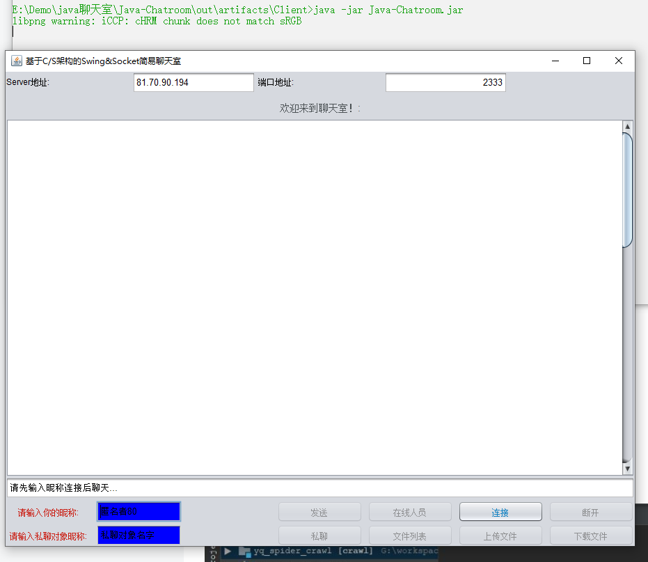

<!--
 * @Author: gong hao jing
 * @Date: 2021-03-16 15:31:57
 * @LastEditTime: 2021-09-04 16:58:01
 * @LastEditors: Please set LastEditors
 * @Description: In User Settings Edit
 * @FilePath: \Java-Chatroom\README.md
-->

# Java Socket Chat-Room

> Swing GUI,socket network

# Java 聊天室代码，在客户端和服务器上分别运行代码

这是一个基于 Java Socket 和 swing 界面设计的 C/S 架构的 java 聊天室项目。可实现局域网或公网聊天和传输文件。服务器以命令行显示运行，客户端程序以 UI 界面的形式运行。

## 目录结构


图中所示的两个文件即为该项目的两个可执行文件，上面那个是客户端的，下面那个是服务器的，要让客户端软件正常运行必须先运行服务器，服务器可运行在公网的一台机器上，也可以运行在局域网的一台主机上，甚至是客户端主机上。

## 如何使用

### 1.运行服务器程序

1. 切换到 Server 目录下，打开 cmd,通过命令行运行

```java
java -jar java-Chatroom.jar
```


当命令行中出现正在监听端口的时候表明服务器运行成功。

### 2.运行客户机程序

1. 切换到 Client 目录下，打开 cmd，通过命令行运行

```java
java -jar Java-Chatroom.jar
```

输入命令后客户端程序会运行
 2. **填写服务器地址，在 Server 地址那一栏里填入服务器的 ip 地址**
如果是本机的话填写 localhost,端口号用默认的 2333 3. **点击连接，默认群发消息，可以私发** 4. **文件上传与下载：**
上传或下载的文件默认保存的 jar 包运行目录的 file 文件夹下，发送文件时，需要在消息框输入文件的绝对路径，下载文件时，需要输入文件名，下载的文件默认保存在 file 目录下，可通过文件列表按钮来查询服务端的文件。

**windos**平台获取文件绝对路径：
按住**shift**键，然后右键单击文件，选择复制为路径，然后把路劲粘贴到聊天框里（**注意：**需要把文件路径的双引号给删了）

**Java 聊天室代码，在客户端和服务器上分别运行代码,jar 包在 out 文件夹**
